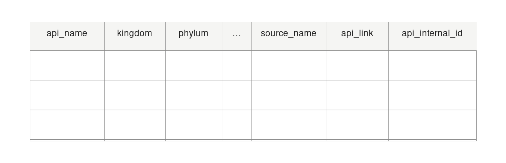

```{=latex}
\begin{center}
  \vspace{0.5em}
  {\large \textbf{Project Mentor:} Payman Nickchi (UBC MDS Faculty)} \\[0.4em]
  {\large \textbf{Capstone Partner:} Paul Bucci (Informatics Curator, UBC Beaty Biodiversity Museum)} \\[0.8em]
  {\large June 17, 2026}
\end{center}
\vspace{1em}
```

# Executive Summary {#sec-executive-summary}

At the Beaty Biodiversity Museum, curators keep millions of physical specimens organized and labeled based on the most current scientific consensus about their taxonomy, including the species name and phylogenetic tree. Since taxonomy is constantly changing, many different synonyms may be used to label the same species in different publications [@sandall2023]. We propose a web app that gathers synonym and taxonomic information from many online sources, presenting it to curators in multiple ways and providing direct links back to each source, so they can make an informed decision about which designation to incorporate into the museum's database. The live application and source code are linked in [Appendix A](#sec-appendix-a).

# Introduction {#sec-introduction}

Taxonomy refers to classifying organisms into hierarchical groups based on shared characteristics and evolutionary relationships. Within Beaty, curators are responsible for ensuring every specimen is identified, classified, and stored appropriately [@rossellomora2011]. Since taxonomy is an ever-evolving field, individual species names can change over time, introducing synonyms, basionyms, variants, subspecies, and more. Beyond just the name, entire taxonomic classifications (e.g. family, order) can change, introducing further uncertainty around where organisms should physically and digitally be stored.

Many online databases compile updated species names and taxonomic classification changes from millions of individual publications. Currently, curators access these resources individually, manually comparing competing information based on their expert knowledge of Beaty's current organization scheme. Our web app will speed up this process by making API calls to online sources and creating a combined list of species synonyms and additional information, such as author names and year of publication, to help curators decide which synonym to use. This will give curators a more consistent, reproducible, and faster workflow to classify and label specimens.

To achieve this, our app queries a list of well-known databases relevant to the species being searched, gathers all results, and presents them to the curator in several different views. The Overview view lists all synonyms returned from the search alongside the databases that contain them. The Detail view shows the full search results from every database, with an option to download as a CSV file. The Relations view provides an interactive graph of synonyms grouped by genus. The Timeline view shows when each name was published and by whom in chronological order. Finally, the Taxonomy view displays the species' classification across ranks such as Kingdom, Phylum, Class, Order, Family, and Genus. The aggregated results include direct links back to their source databases, consolidating the information a curator needs in one place without having to open multiple sites manually.

# Data {#sec-data}

## Data Sources

All data is sourced on-demand via APIs and web scraping from 30+ individual websites hosting species synonyms and taxonomic information. Because taxonomy is updated frequently, data is collected dynamically to ensure our web app always displays the most current information. A full list of sources — including those currently implemented, suggested for future use, and those we were unable to implement — is provided in [Appendix B](#sec-appendix-b).

## Data Size and Structure

Most search queries will yield fewer than 100 synonym names (and associated data, such as author and publication year) per source, across under 30 sources, yielding fewer than 3000 results per query, each containing 16 short-string fields. Because data is fetched dynamically, no long-term storage is needed. Given this small data volume, we chose to organize the raw data into a structured data table because it is the most intuitive for both the developers and end users.

The original raw data enters our pipeline from API calls to each source, which return data in JSON, HTML, or XML format. For each source, we parse the raw data to collect as many of the following fields as possible. Four fields are required: the API name, genus and species names, and the source's internal record ID. All remaining fields are optional, as not all APIs will include all fields. For most sources, the taxonomic information is only added to the row(s) for accepted name(s).

- `api_name`: the name of the API that the data came from, e.g. GBIF (required)
- Taxonomic information: (optional)
  - `kingdom`
  - `phylum`
  - `class`
  - `order`
  - `family`
  - `subfamily`
  - `genus` (required)
  - `species` (required)
- `author`: author of the species synonym (optional)
- `publication_name`: name of the publication where the species synonym name was published (optional)
- `publication_year`: year when the species synonym name was published (optional)
- `status`: whether the species name is considered "accepted" or a "synonym" for that API source (optional)
- `source_name`: if the API source includes a citation of their information source, such as a journal article or book, it is included here (optional)
- `api_link`: link to the search result on the API source's website (optional)
- `api_internal_id`: the unique identifier in the API source's database (required)



## Data Quality and Validation

A key distinction in our data is between missing data (no result returned for a given query) and never available data (a field the source does not provide at all). These are represented as empty strings and "N/A," respectively. To enforce this distinction, we designed a formatting function that requires only the four required fields; all omitted optional fields are automatically populated with "N/A." The function rejects any explicit "N/A" values passed in as arguments, and comprehensive type hinting enables linters to flag type errors during development. This ensures that the "N/A" marker is only used when no attempt is made by the developer to pass in any information for that field from that source. Additionally, to guard against broken API calls that always silently return empty results, developers are required to include unit tests using a known query that produces non-blank output for each field their code is expected to populate.

We also perform format validation checks at data entry time for fields where the structure is predictable: API name is restricted to a hardcoded list; taxonomy fields must be single words; publication year must be a four-digit numeric string; status must be "accepted" or "synonym"; and API links must begin with "http://" or "https://." These checks are skipped for blank or "N/A" values.

## Reliability and Monitoring

APIs and website structures change over time, posing a risk to our data pipeline. We have included some structural checks to verify that the fetch calls are still retrieving data and that the expected keywords and fields are present in the responses. Future developers should be aware that these checks cannot catch subtle changes, for example if a piece of data is moved to a new keyword but the old keyword remains, and we encourage ongoing human oversight to monitor for such issues.

Many of the API sources are sparsely maintained and subject to network outages. To address this, we built a "down detector" that checks connectivity to each source at query time and reports outages to the user, allowing them to make informed judgments about the completeness of their results.

## Biases

While we aim to avoid designating any single source as ground truth, as the lack of such a consensus is the central problem our project addresses, where a baseline or default source is required, we use GBIF because it contains general information for every species. The "suggest" feature uses GBIF to determine the kingdom of a search term; we are comfortable with this given expert input that disputed kingdoms are extremely rare. The taxonomy comparison view, by default, calculates edit distance between GBIF's taxonomy and the other sources, and we have also included the option for the user to choose any of the sources as the comparison source. We consider this design decision sufficient to mitigate possible bias from choosing GBIF as the default comparison source.

## Processing and Filtering Raw Data

The main purpose of our project is to process and filter the raw data from the API calls into a structured data set containing relevant information, and visualize that information for the end user via tables and graphs in our web app. The exact steps to process and filter raw data are unique to each API call, so we created a template class, SpeciesAPI, to establish an overall structure and implement each API as a child class with the necessary customization. Each API implementation inherits five mandatory functions to implement, which work together as such:

1. User searches "amanita muscaria"
2. The query string is normalized to "Amanita muscaria"
3. `_fetch_query_data()` turns "Amanita muscaria" into "99487"
4. `_fetch_synonym_data()` gets synonyms for "99487", including metadata such as author, publication name, etc. for each synonym
5. `_fetch_accepted_data()` gets metadata for "99487" itself, as well as taxonomy if available
6. `_compile_synonym_data()` turns the synonym data into a formatted output
7. `_compile_accepted_data()` turns the raw synonym search term data into a formatted output
8. The two outputs are combined and returned

While the actual implementation of each function is unique to each API, the overall purpose, inputs and outputs, and call order of the functions are standardized.

In addition to the five required functions, the SpeciesAPI template also defines many optional helper functions that the API children can implement if needed, such as `_extract_publication_year()` for extracting the publication year from a publication name string (e.g. "(1998). Book of Bugs"). Since not all APIs provide publication year, and of those that do not all need to extract it from a string (some have a clean year already mapped to a keyword/field in the response), not all API children will need to implement this function. Some of the helper functions have a default implementation in the SpeciesAPI parent, such as `_is_infraspecific()` which checks if a species name string contains any of the text patterns that would indicate it is an infraspecific name (e.g. "Amanita muscaria subsp. flavolta"), which we would want to filter out. We have left the flexibility for this function to be overridden in a child class, but expect that most APIs will share the default implementation. Lastly, any child API implementation can always implement entirely new functions. With this design, our processing and filtering use consistent formatting, naming conventions, and organization of functions, while maintaining the required flexibility for each API to have custom code.

# Data Science Methods {#sec-methods}

Our data science methods focused primarily on UX and UI, through usability of the site and visualization techniques, respectively. In terms of overall UX design, we considered Nielsen's 10 Usability Heuristics [@nielsen1994] to simplify and improve the user experience of the site. For example, our Database Selection tab allows users to choose which databases should be shown. Other customizations exist throughout the website design, allowing for a highly tailored user experience.

Visualizations were carefully thought out throughout the site. Information has the capability to be shown in different ways (e.g. timeline view can be horizontal or vertical). Information is also encoded using different visual channels: color, size, and shape carry purposeful meaning throughout the site, indicating synonym acceptance, prevalence of synonyms, and disagreement between sites.

In terms of statistics, two main methods were used. In the Taxonomy view, Levenshtein edit distance was used for the per-cell taxonomy shading instead of binary match/no-match, so near-misses (spelling/authority variants) are visually distinguished from different classifications. Additionally, summary statistics are utilized to show total synonym and source counts, useful information that is grounded truthfully in what data the API calls gather.

A final data science technique employed here included practices surrounding reproducibility and project collaboration via GitHub. Widely practiced architecture systems support both the frontend and backend of the site. Combined with well-documented code and package environments managed with conda, any collaborator (or the CI runner) can recreate the same site locally. In terms of collaboration, we used Git and GitHub with branch-based development. Pull requests merge into protected main / dev branches, and code review is required before merging. A GitHub Actions CI/CD pipeline runs the automated pytest suite on every pull request so a wide range of bugs are caught before they reach the shared branches.

Primary stakeholders for this site include Beaty museum staff. For these stakeholders, false matches or missed synonyms directly affect which names enter the museum database, so naming conventions and consistency matter most to them. Beaty data decisions are made to last; therefore, there are stakeholders downstream as well. These include anyone using Beaty published data or future museum staff who must rely on the accuracy of the data in the museum's database.

Some ethical considerations were made when designing the site; the most significant one being conveying necessary information but not biasing user decisions. To do so, we avoided using colors that have positive or negative associations (e.g. green and red).

# Data Product and Results {#sec-results}

The final product is the web application (Next.js/React + Mantine frontend, FastAPI backend wrapping the Python pipeline, deployed via a Hugging Face Space + Vercel). One query fans out to up to 17 biodiversity databases (GBIF, COL, GenBank, Index Fungorum, Mushroom Observer, Tropicos, and eleven Symbiota portals) through a FastAPI service.

A web app was used over a script/notebook because the end users are museum curators, not programmers. A searchable browser UI removes any setup barrier and fits an exploratory task. Multiple views were used over a single large view to answer different kinds of curatorial questions: "What are the synonyms?" (table); "Where do sources disagree on classification?" (taxonomy grid); "How are names related?" (graph). Trying to force all those views into a single layout would hide clear signals and make the user experience worse.

A key design principle of this tool is to support curators in their decision-making workflow, and not to replace their judgment. In our workflow, a user checks a name against the current online consensus before deciding which designation to enter into the museum's collection database. The tool surfaces and organizes evidence but never overwrites or auto-selects a name. It is not meant to make any decisions for the user, or even influence their decision heavily. This is because users can have decades of experience and knowledge related to this topic, and it was very important to respect that throughout this process.

The structure of the site does include some limitations; a real-time fan-out makes the app only as fast and available as its slowest, least-reliable source, and results are not reproducible snapshots. A possible improvement would be utilizing asynchronous/parallel source calls to cut latency. This was deferred because sequential calls were far easier to debug per-source and the failure-isolation logic was simpler to reason about while the pipeline was still stabilizing.

# Conclusions and Recommendations {#sec-conclusions}

The Beaty Biodiversity Museum must keep an accurate physical and digital record of millions of specimens as taxonomy continually changes. Curators previously resolved synonym conflicts, basionyms, and classification changes by consulting many separate online databases by hand. We built a web application that aggregates synonymy and taxonomic data from up to 30 biodiversity sources and presents it through five linked views (Overview, Detail, Relations, Timeline, and Taxonomy), each with direct links back to the source. This meets the partner's core need by consolidating the evidence a curator must gather and cutting the time spent on it. The tool is decision support only; it organizes evidence but never selects or overwrites a name, leaving the final judgment to curatorial expertise.

The project taught us how much biodiversity APIs differ in structure, coverage, and reliability. Managing this required careful data validation, including a clear distinction between data that is temporarily missing and fields a source never provides. The main technical outcome is a modular, object-oriented pipeline whose template class lets future developers add new sources without changing the rest of the application.

Important limitations remain. Our sources cover mostly extant organisms and include no fossil records. Databases that require API keys or registration, such as Tropicos, GenBank, and MycoBank, were excluded because managing credentials securely was beyond the scope of this capstone. Querying sources in real time also means the app is only as fast as its slowest source, which can slow exploratory work.

We recommend that the museum assign technical staff to add secure credential management, which would unlock key-restricted sources like GenBank and MycoBank, and convert the sequential API calls into asynchronous, parallel requests to cut latency and tolerate outages. Continued refinement of the interface, guided by curator feedback, would further fit the tool to daily museum workflows.

# Citations {#sec-citations .unnumbered}

::: {#refs}
:::

# Appendix A: Project Links {#sec-appendix-a .unnumbered}

- **Web application:** <https://ubc-mds-project.vercel.app/>
- **Source code:** <https://github.com/beatybiodiversitymuseum/ubc-mds-project>

# Appendix B: Data Sources {#sec-appendix-b .unnumbered}

The following table lists the individual data sources integrated into our pipeline, along with their primary taxonomic scope.

| Source | Taxonomic Scope | Implementation Status |
| ------ | --------------- | :---: |
| [AlgaeBase](https://www.algaebase.org/) | Global algal taxonomy | No |
| [AntWeb](https://antweb.org/) | Ant taxonomy | No |
| [Bryophyte Portal](https://bryophyteportal.org/portal/) | Mosses, liverworts, hornworts | Yes |
| [Catalogue of Life](https://www.catalogueoflife.org/) | Global species checklist across all kingdoms | Yes |
| [CCH2](https://cch2.org/portal/index.php) | Plant species & herbarium collections | Yes |
| [Darwin Core (TDWG)](https://dwc.tdwg.org/) | Biodiversity data standard (terms for species, specimens, occurrences) | No |
| [FishBase](https://www.fishbase.se/search.php) | Fish / marine life | Yes |
| [GBIF Occurrence Portal](https://www.gbif.org/occurrence/search) | Global biodiversity occurrences | Yes |
| [GenBank](https://www.ncbi.nlm.nih.gov/genbank/) | Nucleotide sequences across all life (genomic DNA, mRNA, rRNA, viral genomes, metagenomes) | Yes |
| [iDigBio Portal](https://portal.idigbio.org/portal/search) | Aggregated US biodiversity data | No |
| [iNaturalist](https://www.inaturalist.org/) | Plants, animals, fungi (citizen science) | No |
| [Index Fungorum](https://www.indexfungorum.org/) | Scientific names of fungi | Yes |
| [ITIS](https://www.itis.gov/) | Plants, animals, fungi, microbes (US federal taxonomic database) | Yes |
| [Lichen Portal](https://lichenportal.org/portal/) | Lichenized fungi | Yes |
| [Macroalgae.org](https://macroalgae.org/portal/) | Algae herbarium data | Yes |
| [Mid-Atlantic Herbaria](https://midatlanticherbaria.org/portal/) | Mid-Atlantic plant collections | Yes |
| [Mushroom Observer](https://mushroomobserver.org/) | Mushrooms / fungi | Yes |
| [MycoMap](https://www.mycomap.com/) | Fungal observations & analytics | No |
| [MyCoPortal](https://mycoportal.org/portal/) | Fungi / fungal collections | Yes |
| [NANSH](https://nansh.org/portal/index.php) | Small Herbaria (plants) | Yes |
| [NE Herbaria Portal](https://portal.neherbaria.org/portal/) | Northeastern US herbarium collections | Yes |
| [PteridoPortal](https://pteridoportal.org/portal/) | Pteridophytes (ferns & allies) | Yes |
| [SERNEC](https://sernecportal.org/portal/index.php) | 233 herbaria in southeastern USA | Yes |
| [Species Fungorum](http://www.speciesfungorum.org/) | Scientific names of fungi | No |
| [SW Biodiversity](https://swbiodiversity.org/) | Botanical data (Arizona—New Mexico) | Yes |
| [Symbiota Portals](https://symbiota.org/symbiota-portals/) | Many taxonomic groups depending on portal | Yes |
| [Tropicos](https://www.tropicos.org/home) | Plants / herbs | Yes |
| [VertNet](https://vertnet.org/) | Vertebrate biodiversity data | No |
| [Wikipedia](https://www.wikipedia.org/) | General reference across all taxonomic groups | No |

: {tbl-colwidths="[35,50,15]"}
